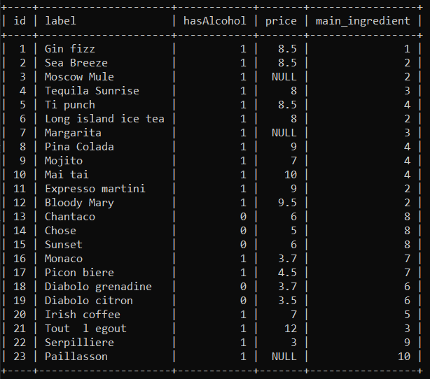
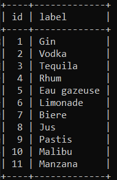

##DOJO SQL BASICS

Le but de ce dojo est de vous familiariser avec les commandes de bases en SQL.

##INSTALLATION
Créez la base de données *dojo_sql_basics*.
Importez (ou copiez/collez) le fichier database.sql dans la base de données nouvellement créée.
[Fichier SQL] (./database.sql)

##VUE DES TABLES
###Drinks

###Ingredients

##REQUETES SQL
* 1: Donnez le nom et le prix de chaque boisson sans alcool
* 2: Triez les boissons par présence d'alcool, puis par ordre décroissant de prix
* 3: Donnez les 3 boissons contenant de l'alcool les plus chères
* 4: Donnez la boisson sans alcool la moins chère, en utilisant LIMIT ou TOP
* 5: Donnez la boisson avec alcool la moins chère, **SANS** utiliser ni LIMIT ni TOP
* 6: Donnez le prix moyen des boissons avec alcool
* 7: Donnez la liste des boissons dont les ingrédients principaux sont le gin ou le rhum
* 8: L'ingrédient principal de la boisson 'Irish Coffee' est le whisky. Rajoutez l'ingrédient et modifiez l'enregistrement concerné pour lui rajouter cette information.
* 9: Certaines boissons n'ont pas de prix. Modifiez les pour les mettre à 5. **Attention**, vous devez tous les modifier en une seule requête.
* 10: Rajoutez à la table Drinks le cocktail suivant : Le 'Pélican' au prix de 4, Alcoolisé et dont l'Ingrédient principal est le Pastis
* 11: Un ingrédient n'est pas utilisé. Supprimez le. **Attention**, vous devez le supprimer en une seule requête (donc en faisant une requête qui dit : Supprime de la table des ingrédients l'ingrédient qui n'est pas l'ingrédient principal dans la table des boissons).